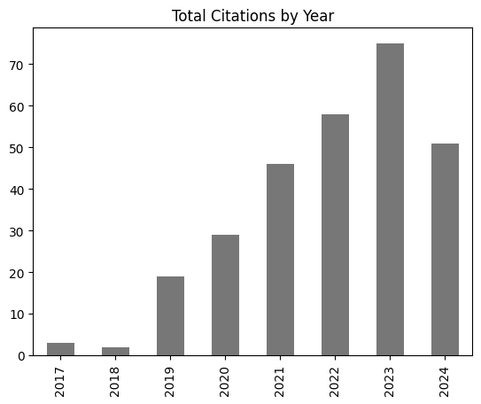
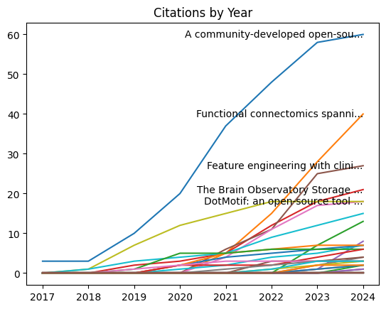

# scholarversary

Scholarversary is a milestone-finder for academic careers through the (limited!) lens of publishing.

```
pip install scholarversary
```

## Citation Milestones

```python
import scholarversary as sv

sv.Scholarversary().citations()
```

## Citations by year (replicate the "Google Scholar" chart)

```python
import pandas as pd

wcby = s.get_author_work_cites_by_year("Jordan Matelsky", index_by="title")

(
    pd.DataFrame(wcby)
    .fillna(0)
    .astype(int)
    .sort_index()
    .sum(axis=1)
    .plot.bar(title="Total Citations by Year", color="#777")
)
```



### 1, 10, 20, 50, 100, 200, ... Total Citations

```python
s = Scholarversary()
s.get_author_citation_milestone_dates("Jordan Matelsky")
```

```python
{1: '2017-04-17',
 10: '2019-01-01',
 50: '2020-08-31',
 100: '2021-11-01',
 200: '2023-04-13'}
```

### Surpassing previous year in citations

## Per-Paper Metrics

```python
df = pd.DataFrame(wcby).fillna(0).astype(int).sort_index()
# Get columnwise cumulatives:
dfc = df.cumsum(axis=0)

dfc.plot.line(legend=False, title="Citations by Year")
top_works = dfc.max().sort_values(ascending=False).index[:5]
for work in top_works:
    plt.text(df.index[-1], dfc[work].iloc[-1], work[:30] + "...", ha="right", va="center")
plt.show()
```



### Paper Milestones

#### 1st, 10, 20, 50, 100, 200, ... Citations

#### First collaboration with a new co-author

#### New journal / venue
